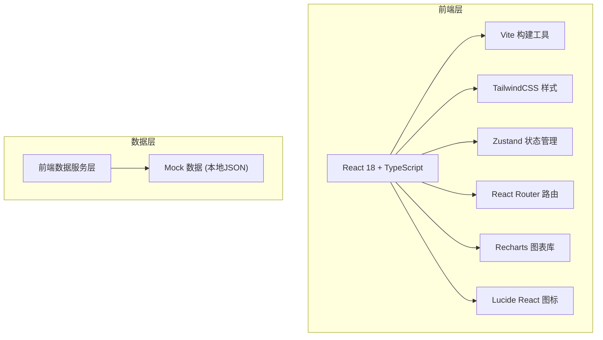
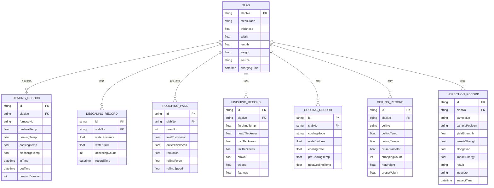

## 1. 架构设计



## 2. 技术描述

- **前端框架**：React 18 + TypeScript
- **构建工具**：Vite 5
- **样式方案**：TailwindCSS 3
- **状态管理**：Zustand
- **路由方案**：React Router DOM 6
- **图表库**：Recharts（折线图、柱状图、面积图、饼图）
- **图标库**：Lucide React
- **后端**：无后端，使用前端 Mock 数据模拟真实业务
- **数据库**：无数据库，使用 TypeScript 类型定义 + Mock 数据

## 3. 路由定义

| 路由 | 页面名称 | 用途 |
|------|----------|------|
| /dashboard | 看板总览 | 生产实时概览、KPI指标、趋势图表 |
| /slab-charging | 板坯入炉 | 板坯入炉排序、板坯信息管理 |
| /heating-furnace | 加热炉 | 炉温制度、出炉温度记录、炉况监控 |
| /roughing-mill | 粗轧除鳞 | 高压水除鳞、粗轧道次压下 |
| /finishing-mill | 精轧机组 | 终轧温度、厚度检测、板形凸度 |
| /laminar-cooling | 层流冷却 | 冷却制度、温度监控 |
| /coiling | 卷取打捆 | 卷取温度控制、打捆称重 |
| /inspection | 性能检验 | 力学性能取样、检验记录、质量报告 |

## 4. 数据模型

### 4.1 核心实体定义



### 4.2 数据结构（TypeScript 类型）

```typescript
// 板坯
interface Slab {
  id: string;
  slabNo: string;
  steelGrade: string;
  thickness: number;
  width: number;
  length: number;
  weight: number;
  source: string;
  status: 'pending' | 'charging' | 'heating' | 'rolling' | 'cooling' | 'coiling' | 'inspecting' | 'finished';
  chargingTime?: string;
}

// 加热记录
interface HeatingRecord {
  id: string;
  slabNo: string;
  furnaceNo: string;
  preheatTemp: number;
  heatingTemp: number;
  soakingTemp: number;
  dischargeTemp: number;
  inTime: string;
  outTime?: string;
  heatingDuration: number;
}

// 除鳞记录
interface DescalingRecord {
  id: string;
  slabNo: string;
  waterPressure: number;
  waterFlow: number;
  descalingCount: number;
  recordTime: string;
}

// 粗轧道次
interface RoughingPass {
  id: string;
  slabNo: string;
  passNo: number;
  inletThickness: number;
  outletThickness: number;
  reduction: number;
  rollingForce: number;
  rollingSpeed: number;
}

// 精轧记录
interface FinishingRecord {
  id: string;
  slabNo: string;
  finishingTemp: number;
  headThickness: number;
  midThickness: number;
  tailThickness: number;
  crown: number;
  wedge: number;
  flatness: number;
}

// 冷却记录
interface CoolingRecord {
  id: string;
  slabNo: string;
  coolingMode: string;
  waterVolume: number;
  coolingRate: number;
  preCoolingTemp: number;
  postCoolingTemp: number;
}

// 卷取记录
interface CoilingRecord {
  id: string;
  slabNo: string;
  coilNo: string;
  coilingTemp: number;
  coilingTension: number;
  drumDiameter: number;
  strappingCount: number;
  netWeight: number;
  grossWeight: number;
}

// 性能检验记录
interface InspectionRecord {
  id: string;
  slabNo: string;
  sampleNo: string;
  samplePosition: string;
  yieldStrength: number;
  tensileStrength: number;
  elongation: number;
  impactEnergy: number;
  result: 'qualified' | 'unqualified' | 'pending';
  inspector: string;
  inspectTime: string;
}
```

## 5. 项目目录结构

```
src/
├── components/          # 可复用组件
│   ├── layout/         # 布局组件（Sidebar、Header、Layout）
│   ├── charts/         # 图表组件
│   ├── common/         # 通用组件（Card、Button、Table、Badge等）
│   └── forms/          # 表单组件
├── pages/              # 页面组件
│   ├── Dashboard.tsx
│   ├── SlabCharging.tsx
│   ├── HeatingFurnace.tsx
│   ├── RoughingMill.tsx
│   ├── FinishingMill.tsx
│   ├── LaminarCooling.tsx
│   ├── Coiling.tsx
│   └── Inspection.tsx
├── store/              # Zustand 状态管理
│   └── useStore.ts
├── data/               # Mock 数据
│   └── mockData.ts
├── types/              # TypeScript 类型定义
│   └── index.ts
├── utils/              # 工具函数
│   └── format.ts
├── App.tsx
├── main.tsx
└── index.css
```
